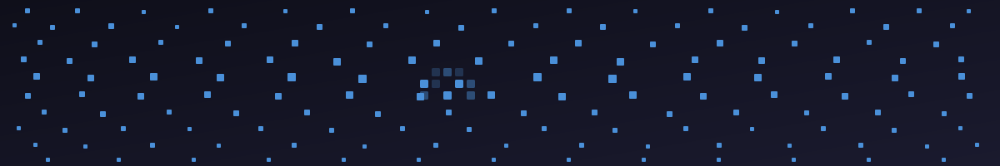

<!-- header jpg -->

<h1 align="center"> Hi 👋🏾, I'm Christie P. </h1>

<!-- Profile Views -->

  

Cloud Security & Infrastructure Engineer with a background in software engineering and IT systems administration. I build and document hands-on projects in cloud security, SIEM operations, IAM, data privacy, and infrastructure-as-code. Currently completing my M.S. in Cybersecurity at WGU while exploring how AI supports modern infrastructure and threat detection.

---

## Certifications
 

²_CC-272b33?style=for-the-badge&logo=isc2&logoColor=white)

---
 
##  What I Work With
 
**Cloud & Infrastructure**
 

 
**Security & Monitoring**
 

 
**Languages & Dev**
 

 
**Systems & Tools**
 

 
---
 
##  Current Projects
 
| Project | Status | Stack |
|---------|--------|-------|
| **Security Operations Home Lab** | 🔨 Building | Wazuh, Keycloak, Presidio, Terraform, VirtualBox |
| **AWS Security Posture Scanner** | 🔨 Building | AWS Lambda, Python, CIS Benchmarks, SNS, Terraform |

---
 <picture>
  <source media="(prefers-color-scheme: dark)" srcset="https://github.com/securepixels/securepixels/blob/output/github-snake-dark.svg" />
  <source media="(prefers-color-scheme: light)" srcset="https://github.com/securepixels/securepixels/blob/output/github-snake.svg" />
  
</picture>

<!-- GitHub section -->

<!-- ## Support 💙

  

 -->

<!--
**chrissyacoder/chrissyacoder** is a ✨ _special_ ✨ repository because its `README.md` (this file) appears on your GitHub profile.
-->
